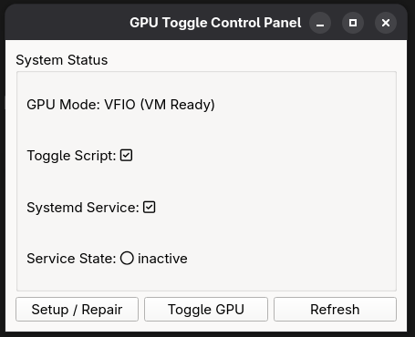

# GPU VFIO Toggle GUI (Fedora)

A PyQt5-based GUI tool for **Fedora Linux (latest release)** that allows advanced users to toggle an **NVIDIA GPU** between:

- 🟢 **Host Mode** – NVIDIA driver bound (normal desktop usage)
- 🔵 **VFIO Mode** – GPU bound to `vfio-pci` for VM passthrough

This project was **developed and tested on**:

- Fedora (latest)
- Wayland session
- NVIDIA **RTX 3050 Mobile**
- KVM / QEMU with VFIO

---

## ⚠️ IMPORTANT WARNING (READ FIRST)

This tool is **NOT plug-and-play**.

It is intended for **advanced Linux users** who already:
- Understand GPU passthrough (VFIO)
- Have IOMMU enabled
- Have a **secondary GPU or iGPU** for the host
- Know how to recover from a broken display session

⚠️ Incorrect configuration **can**:
- Kill your graphical session
- Require a reboot
- Break GPU drivers temporarily

Use at your own risk.

---

## ✨ Features

- Simple GUI control panel
- Detects current NVIDIA GPU state (NVIDIA / VFIO)
- One-click toggle Host ↔ VFIO
- Automatically creates:
  - `/usr/local/bin/toggle-nvidia-vfio.sh`
  - `/etc/systemd/system/toggle-nvidia-vfio.service`
- Uses `pkexec` (polkit) for safe privilege escalation
- Live status refresh

---

## 🖥️ Screenshot



---
##🔧 How It Works
The application controls GPU switching through a systemd oneshot service that runs a shell script with root privileges.

When toggling Host → VFIO, the following happens:

The display manager is stopped

NVIDIA kernel modules are unloaded

The NVIDIA GPU and its audio function are unbound

The devices are bound to vfio-pci

The host GPU (AMD or Intel iGPU) is ensured to be active

The display manager is restarted

When toggling VFIO → Host, the process is reversed:

The display manager is stopped

The GPU is unbound from vfio-pci

NVIDIA kernel modules are reloaded

The GPU is rebound to the NVIDIA driver

The display manager is restarted

🖥️ Why the Display Manager Is Stopped

The display manager (GDM, SDDM, etc.) actively uses the GPU for rendering the desktop.

As long as the GPU is in use:

It cannot be unbound from the driver

Kernel driver switching will fail

The system may freeze or crash

Stopping the display manager:

Releases the GPU cleanly

Allows safe driver unbinding

Prevents kernel panics

On Wayland (Fedora default), the screen going black briefly is expected behavior.

🛠️ What Users Must Change (Critical)

The toggle script uses hard-coded PCI device IDs that must be adapted per system.

Users need to update:

The NVIDIA GPU PCI ID

The NVIDIA audio PCI ID

The host GPU PCI ID

These values differ between machines.

PCI IDs can be found using:

lspci -nn | grep -E "VGA|3D|Audio"


Supported setups:

Intel iGPU + NVIDIA GPU (recommended)

AMD GPU + NVIDIA GPU

Unsupported setups:

Single-GPU systems

Systems without a functional fallback GPU


## 📦 Requirements

### System
- Fedora Linux (latest)
- systemd
- Wayland or X11
- NVIDIA GPU + secondary GPU (AMD or Intel iGPU)
- VFIO already configured in kernel parameters

### Software
- Python 3
- PyQt5
- NVIDIA proprietary drivers
- `vfio-pci` kernel module
- polkit (`pkexec`)

---

## 🚀 Installation & Run

### 1️⃣ Install dependencies

**Fedora (recommended):**
```bash
sudo dnf install python3-qt5
```
Or using pip:
```bash
pip install -r requirements.txt
```
